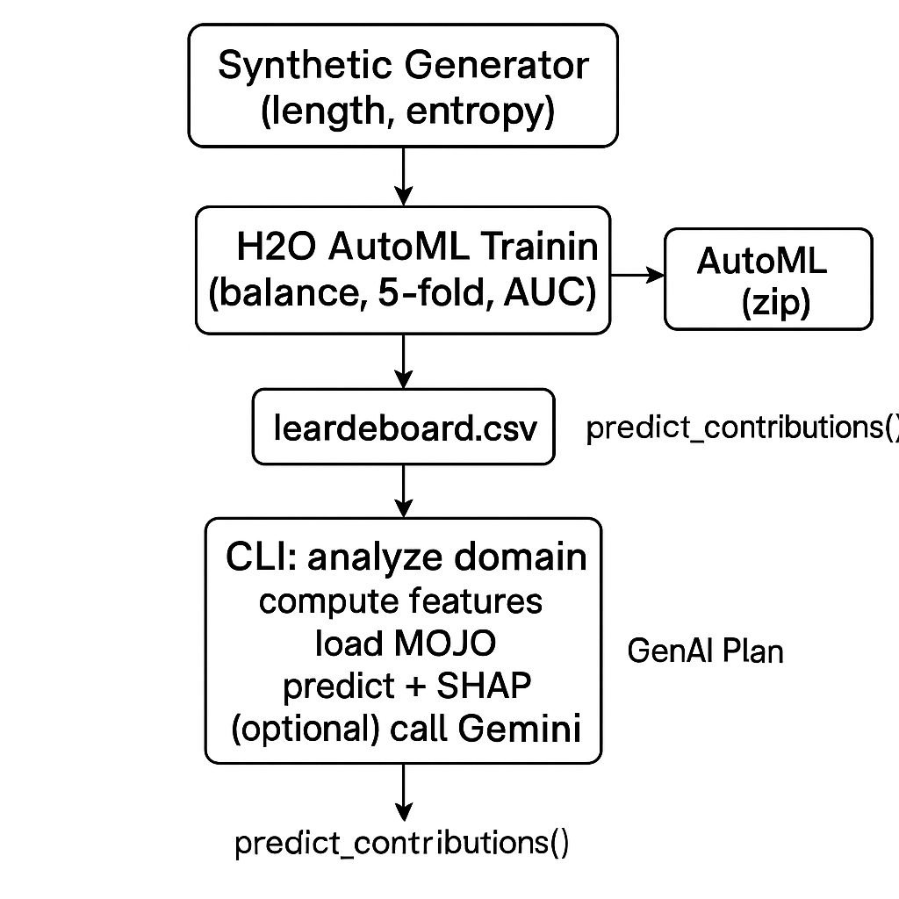

[](https://github.com/vk-sec/G40027645_SEAS8414_Week_9_HW/actions/workflows/lint.yml)

# SEAS 8414 – Week 9 Homework  
## Detecting DGA Domains with H2O AutoML + GenAI Playbooks

This project demonstrates how to:  
1. Train a machine learning model (using [H2O AutoML](https://docs.h2o.ai/)) to detect **Domain Generation Algorithm (DGA)** domains.  
2. Export the model as a **MOJO** for portable scoring.  
3. Analyze a given domain name with the trained model.  
4. Explain the model’s decision using SHAP / contribution analysis.  
5. Generate a **prescriptive incident response playbook** using Google’s Gemini API.  

## Goals

Provide an end-to-end “detection → explanation → prescription” workflow.

Train with H2O AutoML, export a MOJO, and reuse it for scoring.

Demonstrate an XAI-to-GenAI bridge for actionable incident response.


## 🛠️ Prerequisites

- **Windows 10/11** with [PyCharm](https://www.jetbrains.com/pycharm/) or any IDE  
- **Python 3.10+** (installed system-wide or via `pyenv`)  
- **Java 17** (OpenJDK / Temurin)  
- [Git](https://git-scm.com/downloads)  
- A valid **Google API key** for Gemini (`GOOGLE_API_KEY`)  

### Install Python dependencies

It is recommended to use a virtual environment:

```powershell
python -m venv .venv
.venv\Scripts\activate
pip install -r requirements.txt
```
## refer to the makefile to follow the usage examples

Install dependencies
- make install

Train model with 6000 rows, 30 sec runtime
- make train

Analyze default test domain
- make analyze

Analyze a custom domain
- make analyze DOMAIN=example-botnet.com

Clean everything
- make clean

## Architecture




